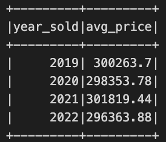
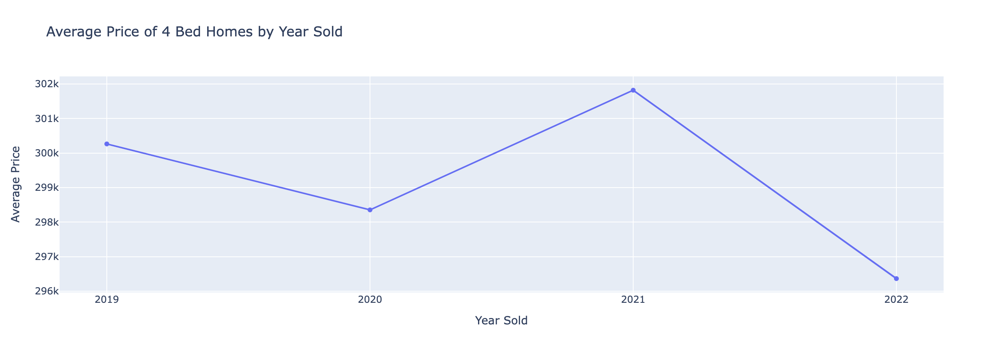
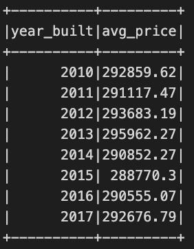
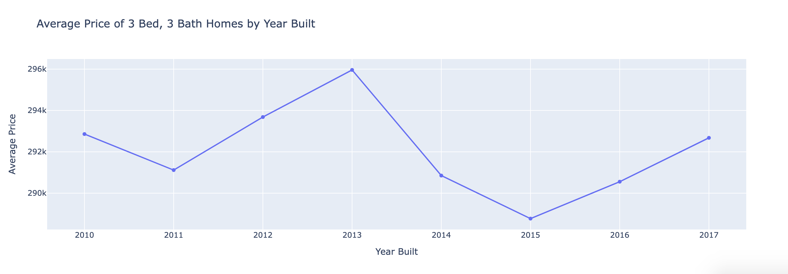
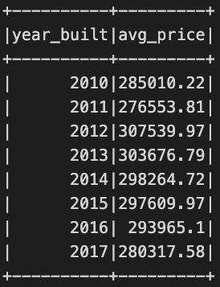
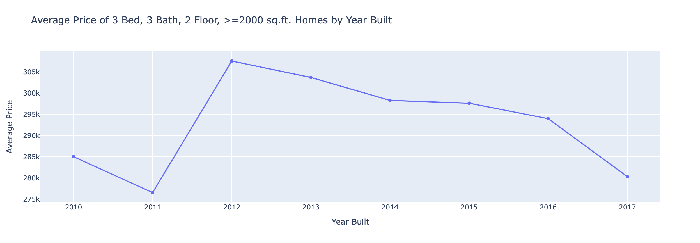
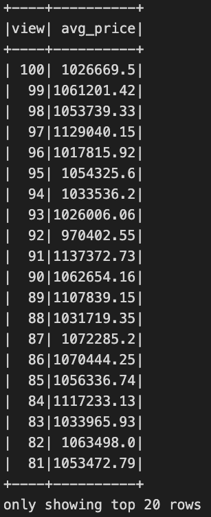
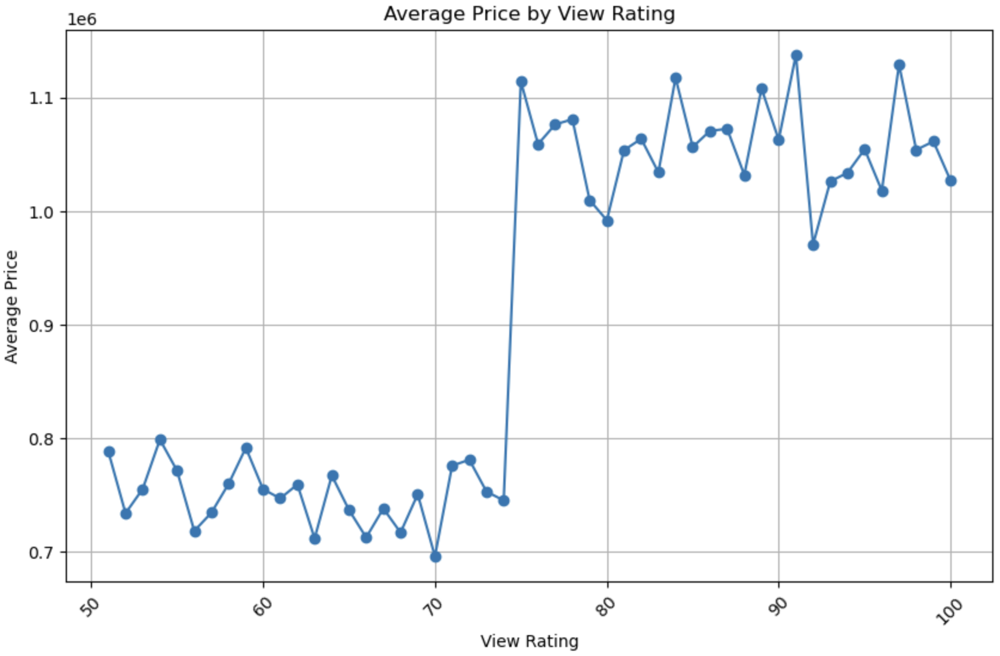

# Home-Sales-challenge
- Module 22 Challenge
- Steph Abegg

This challenge demonstrates the usage of PySpark and SparkSQL to determine key metrics on home sale data from 2019 to 2022. We use Spark to create temporary views, partition the data, cache and uncache a temporary table, and verify that the table has been uncached.

The data is loaded from an S3 bucket but can also be found in this repository at [home_sales_revised.csv](Resources/home_sales_revised.csv) . The analysis is done in the [Home_Sales.ipynb](Home_Sales.ipynb) notebook.

## Query Analysis

I analyzed the data to answer the following questions:

1. What is the average price for a four-bedroom house sold for each year?

```python
SELECT
    YEAR(date) AS year_sold,
    ROUND(AVG(price), 2) AS avg_price
FROM home_sales
WHERE bedrooms=4
GROUP BY year_sold
ORDER BY year_sold
```




In this case, four years of data is not enough to detect an obvious trend in average price of four-bedroom homes from year to year.

2. What is the average price of a home for each year the home was built, that has three bedrooms and three bathrooms?

```python
SELECT
    date_built as year_built,
    ROUND(AVG(price), 2) AS avg_price
FROM home_sales
WHERE bedrooms=3 AND bathrooms=3
GROUP BY year_built
ORDER BY year_built
```




Three-bedroom, three-bathroom homes built in 2015 have the lowest average sale price of these kind of homes while three-bedroom, three-bathroom homes built in 2013 have the highest average sale price of these kind of homes. The trend appears to be a bit sinusoidal, but more data would be needed to see if this trend continues.

3. What is the average price of a home for each year the home was built, that has three bedrooms, three bathrooms, two floors, and is greater than or equal to 2,000 square feet?

```python
SELECT
    date_built as year_built,
    ROUND(AVG(price), 2) AS avg_price
FROM home_sales
WHERE
    bedrooms=3
    AND bathrooms=3
    AND floors=2
    AND sqft_living>=2000
GROUP BY year_built
ORDER BY year_built
```




Three-bedroom, three-bathroom, two-floor, at least 2000 square foot homes built in 2010 and 2011 have lower average sale prices while the same sorts of homes built in 2012 have the highest average sale price, decreasing for year built more recent than 2012. It is interesting to compare these results to the previous section--filtering to 2 floors and at least 2000 square feet changes the pattern of average sale prices by year built.


4. What is the average price of a home per "view" rating having an average home price greater than or equal to $350,000?
   
```python
SELECT
    view,
    ROUND(AVG(price), 2) AS avg_price
FROM home_sales
GROUP BY view
HAVING avg_price >= 350000
ORDER BY view DESC
```



50 results returned.



Average price of a home is lower ($700,000-$800,000) for view ratings 50-74, and higher ($1,000,000-$1,100,000) for view ratings 75-100. There do not appear to be average prices between $800,000-1,000,000, so the housing price data is a bit clustered. 

## Run Time Analysis

The last question was used to compare run time with a cached table and partitioned parquet data (with the query being modified to use the partitioned table). The partition was by the "date_built" field. The results of running the query five times are shown in the table below in seconds:

|   | 1 (load)    | 2    | 3    | 4    | 5    | Avg 2-5    |
|-------------|-------------|-------------|-------------|-------------|-------------|-------------|
|Standard	|0.4185|	0.2205	|0.4027	|0.3108|	0.5537|	0.3719|
|Cached|	0.4307|	0.2818|	0.2551|	0.1975|	0.2650|	0.2499 |
|Parquet	|0.7521	|0.4725	|0.4590|	0.5148	|0.3451	|0.4479 |

The first run was not included in the average as it was when the cell was run for the first time.

From the time table, we can see that running a query on the cached table was the fastest option. We also see that the partitioned parquet files were the slowest. This is likely due to the partition being on the "date_built" column, which was not used in the query and the size of the data was not very big.
